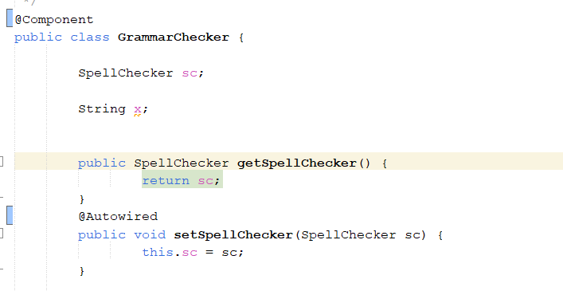
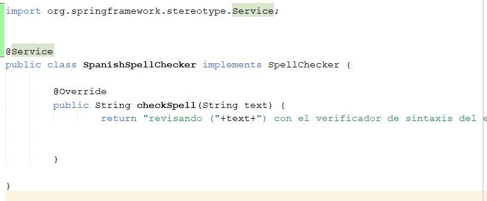
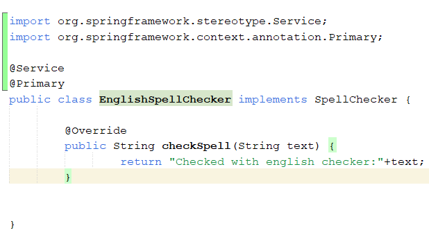
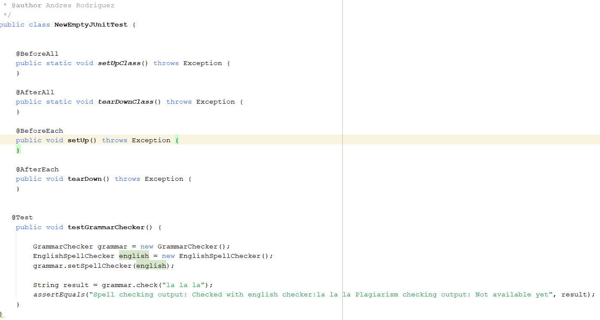
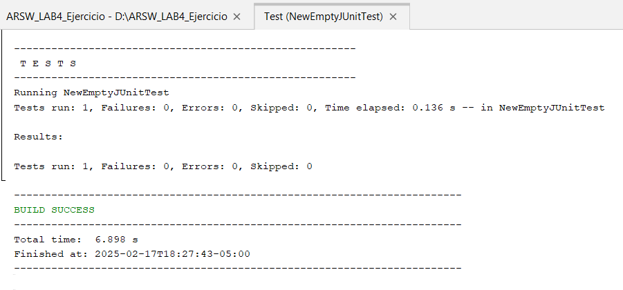

# Escuela Colombiana de Ingeniería
# Arquitecturas de Software - ARSW
### Taller – Principio de Inversión de dependencias, Contenedores Livianos e Inyección de dependencias.

Parte I. Ejercicio básico.

Para ilustrar el uso del framework Spring, y el ambiente de desarrollo para el uso del mismo a través de Maven (y NetBeans), se hará la configuración de una aplicación de análisis de textos, que hace uso de un verificador gramatical que requiere de un corrector ortográfico. A dicho verificador gramatical se le inyectará, en tiempo de ejecución, el corrector ortográfico que se requiera (por ahora, hay dos disponibles: inglés y español).

1. Abra el los fuentes del proyecto en NetBeans.

2. Revise el archivo de configuración de Spring ya incluido en el proyecto (src/main/resources). El mismo indica que Spring buscará automáticamente los 'Beans' disponibles en el paquete indicado.

3. Haciendo uso de la [configuración de Spring basada en anotaciones](https://docs.spring.io/spring-boot/docs/current/reference/html/using-boot-spring-beans-and-dependency-injection.html) marque con las anotaciones @Autowired y @Service las dependencias que deben inyectarse, y los 'beans' candidatos a ser inyectadas -respectivamente-:

	* GrammarChecker será un bean, que tiene como dependencia algo de tipo 'SpellChecker'.
	* EnglishSpellChecker y SpanishSpellChecker son los dos posibles candidatos a ser inyectados. Se debe seleccionar uno, u otro, mas NO ambos (habría conflicto de resolución de dependencias). Por ahora haga que se use EnglishSpellChecker.
 
5.	Haga un programa de prueba, donde se cree una instancia de GrammarChecker mediante Spring, y se haga uso de la misma:

	```java
	public static void main(String[] args) {
		ApplicationContext ac=new ClassPathXmlApplicationContext("applicationContext.xml");
		GrammarChecker gc=ac.getBean(GrammarChecker.class);
		System.out.println(gc.check("la la la "));
	}
	```
	
6.	Modifique la configuración con anotaciones para que el Bean ‘GrammarChecker‘ ahora haga uso del  la clase SpanishSpellChecker (para que a GrammarChecker se le inyecte EnglishSpellChecker en lugar de  SpanishSpellChecker. Verifique el nuevo resultado.


### Desarrollo Taller

Cuando ejecutamos el codigo, notamos que hay bastantes errores, esto debido a que faltan las anotaciones necesarias
para las diferentes clases, para ellos debemos asignar las anotaciones @Component y @Autowired, para la clases grammarcheker
Esto hara que la clase sea un Bean, y como bien dice la descripción tiene algo tipo "SpellCHecker", pues este metodo
lo vamos a sobreescribir en nuestra clase utilizando la anotación @Autowired

 


* EnglishSpellChecker y SpanishSpellChecker son las dos clases que pueden ser inyectados. 
Se debe seleccionar uno,mas NO ambos (habría conflicto de resolución de dependencias). 
Por ahora haga que se use EnglishSpellChecker.

Al ya tener asignadas las anotaciones en el GrammarChecker, podemos asignar a cada clase como un servicio.
Ahora bien para que no se instancien ambos al mismo tiempo podriamos utilizar la anotación @Primary para que no existan problemas de inyección

 

 

Se realizo un programa de prueba, donde se crea una instancia de GrammarChecker

 

 


Para la ultima parte, solamente dejariamos de usar la anotación @Primary en EnglishSpellChecker y la pondríamos en SpanishSpellChecker

